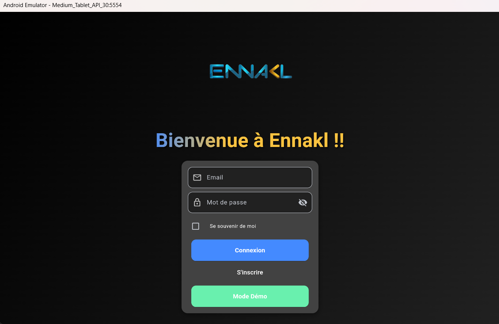
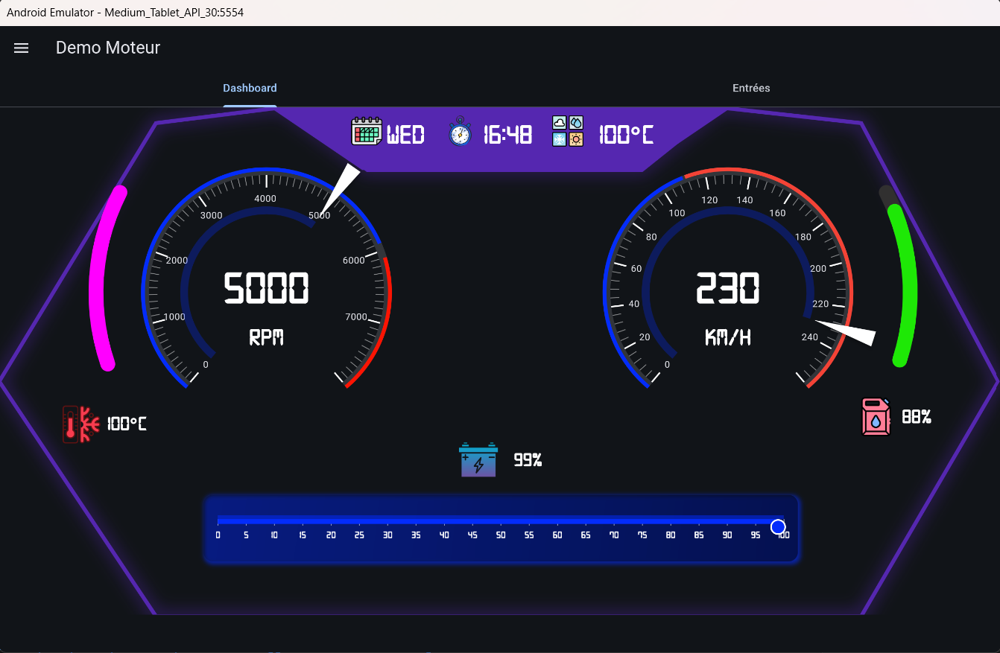
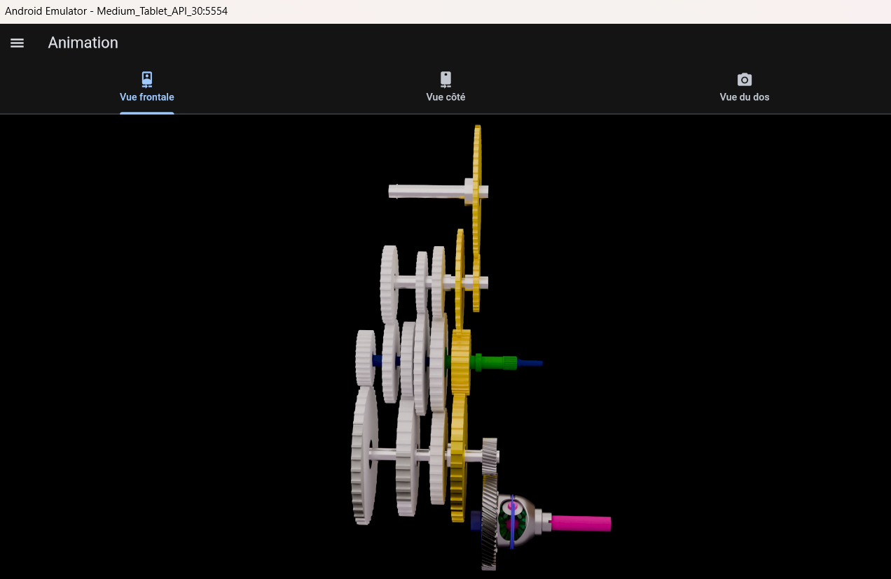

# TechShift Mobile Application

**TechShift Mobile Application** is a Flutter app designed to:  
- Display real-time vehicle data (RPM, speed, temperature, fuel level, etc.).  
- Simulate data in demo mode for training purposes.  
- Provide an interactive 3D animation of a gearbox.  

## Key Features
- **Trainer Mode:** Real-time data retrieval via Firebase.  
- **Demo Mode:** Data simulation for technician training.  
- **3D Animation:** Interactive visualization of a gearbox in action.  

## App Interfaces

### 1. Login Page


### 2. Engine Data Interface


### 3. Gearbox Animation


## Installation
1. Clone this repository:
   ```bash
   git clone https://github.com/Sahar-Gr/TechShift-Mobile-Application.git

