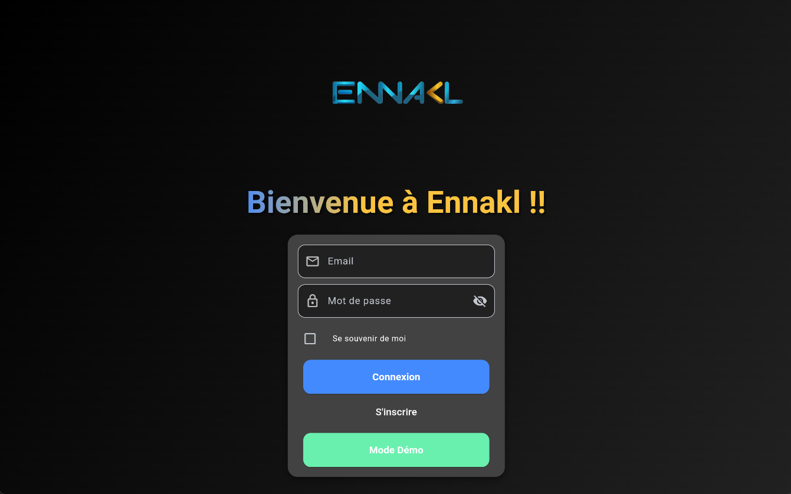
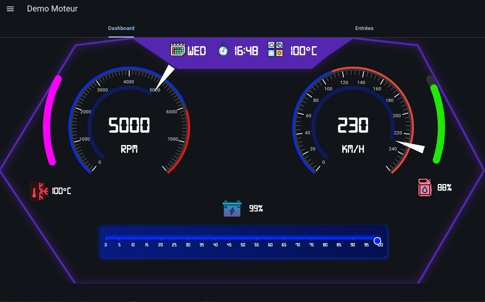
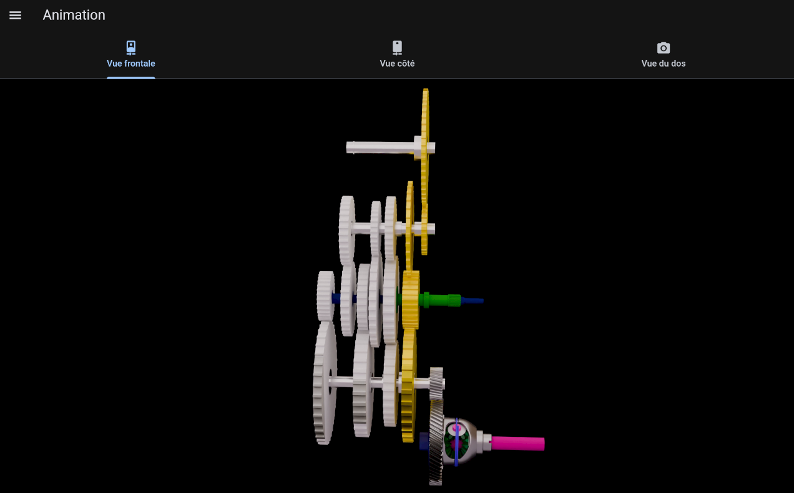

# TechShift Mobile Application

## Overview

This project is a Flutter mobile application designed to visualize real-time vehicle data retrieved from an embedded system.

It is part of a complete system where vehicle data is extracted via CAN (ESP32 + MCP2515), transmitted to Firebase, and displayed in the mobile application.

The application provides both real-time monitoring and a simulation mode for training purposes.

---

## My Role

- Developed the Flutter application interface  
- Integrated Firebase Realtime Database for live data retrieval  
- Implemented real-time data visualization (RPM, speed, temperature, fuel level)  
- Designed a demo mode to simulate vehicle data  
- Built an interactive 3D animation to visualize gearbox behavior  

---

## System Architecture

Vehicle ECU → CAN → ESP32 → Firebase → Mobile App

The mobile application consumes processed data and provides a clear visualization layer for monitoring vehicle behavior.

---

## Key Features

- **Real-time Mode**  
  Displays live vehicle data from Firebase  

- **Demo Mode**  
  Simulates data for testing and training without a real vehicle  

- **3D Gearbox Animation**  
  Interactive visualization of gearbox mechanics  

---

## Application Interfaces

### Authentication Interface  
User login and access to the application  



---

### Real-Time Data Dashboard  
Visualization of vehicle parameters (RPM, speed, temperature, fuel level)  



---

### Gearbox Visualization  
Interactive 3D animation representing gearbox behavior  



---

## Tech Stack

- Flutter  
- Dart  
- Firebase Realtime Database  

---

## Installation

```bash
git clone https://github.com/Sahar-Gr/TechShift-Mobile-Application.git
cd TechShift-Mobile-Application
flutter pub get
flutter run
